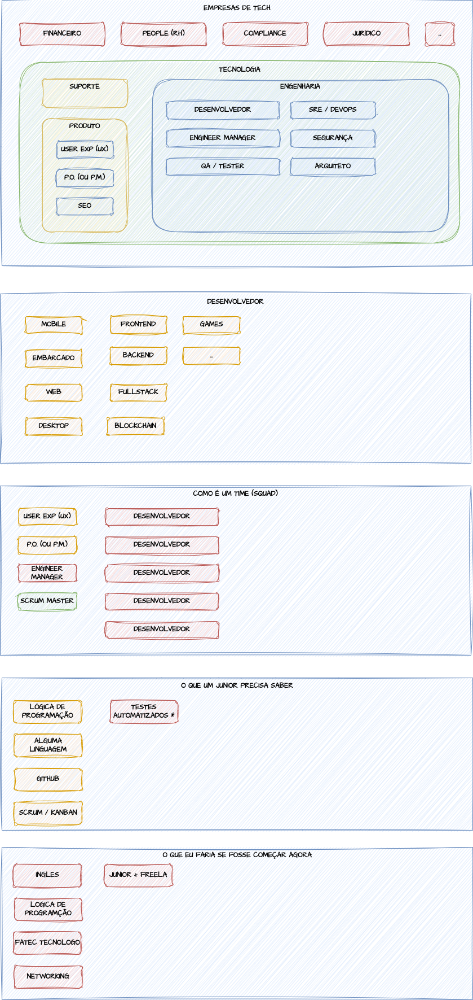

# Study Repository

This is the repository dedicated to ongoing exercises. Contribute, practice, and enhance your skills!

## Content

1. [Introduction](docs/00-introduction.md)
2. Basics
   1. [Variables](docs/01-variables.md)
   2. [If](docs/02-if.md) - ([Exercises](exercises/01-if.md))
   3. [Loops](docs/03-loops.md) - ([Exercises](exercises/02-loops.md))
   4. Array - (Work in Progress)

## Understanding Developers

## Contributing

1. Fork the repository.
2. Implement your changes.
3. Open a pull request.

Thank you for contributing!
